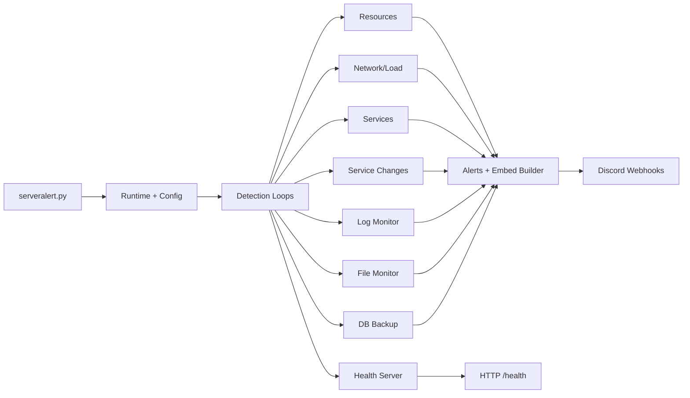

# ServerAlert

Lightweight server monitoring that sends rich Discord embeds for system health, service changes, and security-related log events.

## Highlights
- Minimal dependencies: `psutil`, `requests`
- Modular detection loops with per-category webhooks
- Health endpoint for liveness checks
- Stronger security posture and clearer alert payloads

## Features
- Resource thresholds: CPU, memory, disk, process count, connection count, load average
- Service monitoring: status checks + restart attempts + change detection
- Security log events: SSH login/failed login, sudo usage, privilege escalation, password change, kernel/firewall events
- File change monitoring with SHA-256 diffs
- Scheduled database backups (mysqldump)
- Optional health HTTP endpoint

## Architecture Overview


## Quick Start
```bash
cd /var/www/serveralert
cp .env.example .env
./start.sh install
systemctl start serveralert
```

## Configuration
Configuration is read from `.env` and optional JSON overlay:
- `.env` keys override defaults
- JSON override file: `serveralert_config.json`
- Custom JSON path: `SERVERALERT_CONFIG=/path/to/config.json`

Required:
- Set `WEBHOOK_DEFAULT` (or per-category webhooks) to receive alerts

Key environment groups:
- Thresholds: `CPU_THRESHOLD`, `MEMORY_THRESHOLD`, `DISK_THRESHOLD`, `LOAD_AVG_THRESHOLD`
- Scheduling: `CHECK_INTERVAL_SECONDS`, `ALERT_MIN_INTERVAL`
- Detections: `DETECT_*` toggles
- Webhooks: `WEBHOOK_*`
- Embeds: `EMBED_*`

## Embed Styling
Embeds include host, OS, uptime, and optional imagery. Optional images:
- `EMBED_IMAGE_URL` (default image)
- `EMBED_IMAGE_WARNING_URL`
- `EMBED_IMAGE_CRITICAL_URL`
- `EMBED_THUMB_URL`

## Security Notes
- No default webhook is shipped. You must set a webhook.
- Failed SSH alerts do not include passwords.
- Use least-privilege credentials for DB backups.

## Service Management
```bash
systemctl start serveralert
systemctl stop serveralert
systemctl restart serveralert
systemctl status serveralert
journalctl -u serveralert -f
```


## Project Layout
- `serveralert.py` entrypoint
- `modules/` detection modules and helpers
- `serveralert.service` systemd unit template
- `start.sh` install/run helper

## License
MIT. See `LICENSE`.
